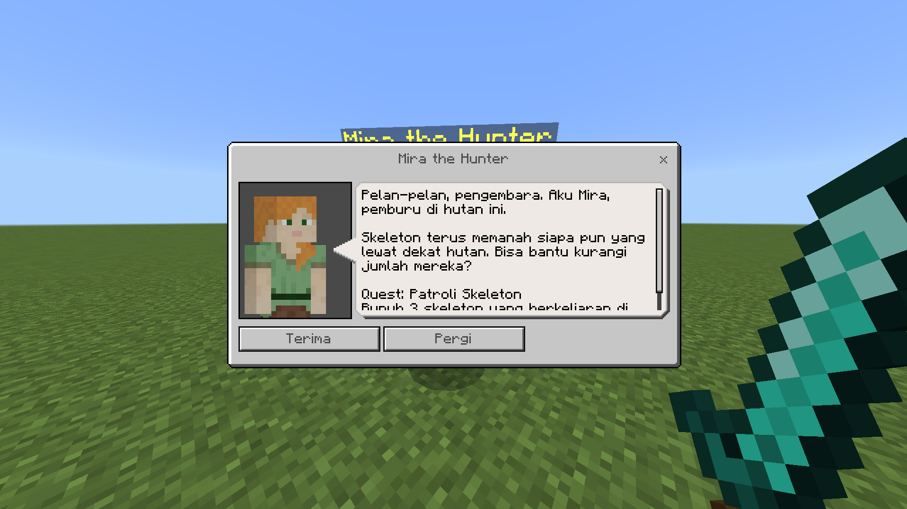
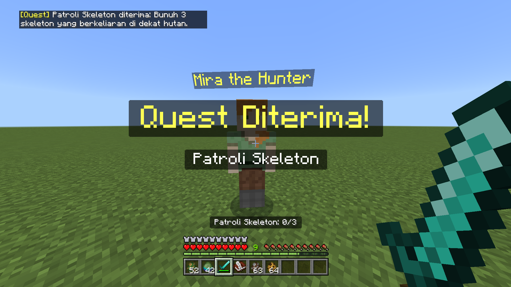
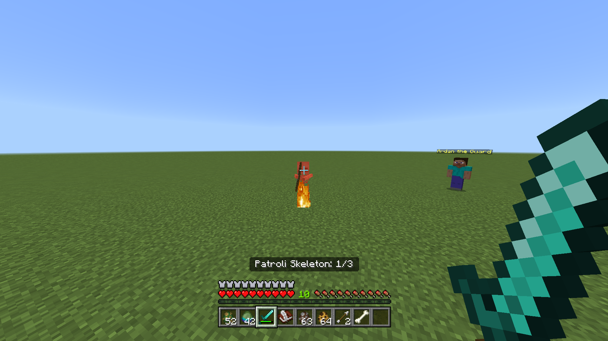
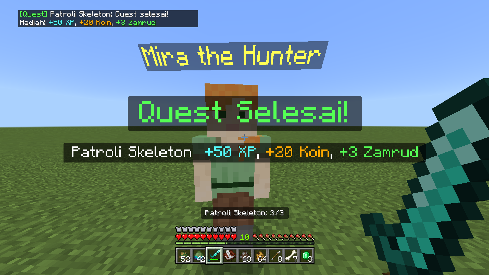
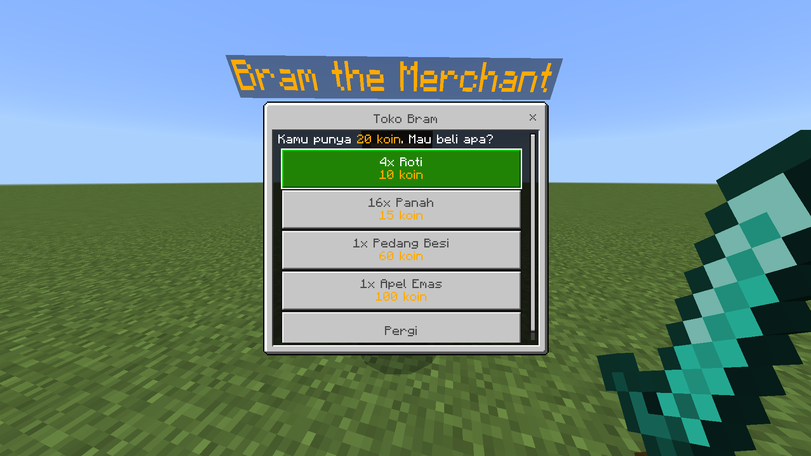
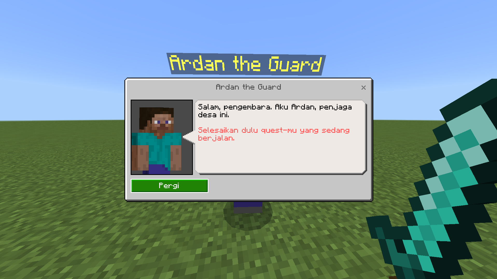
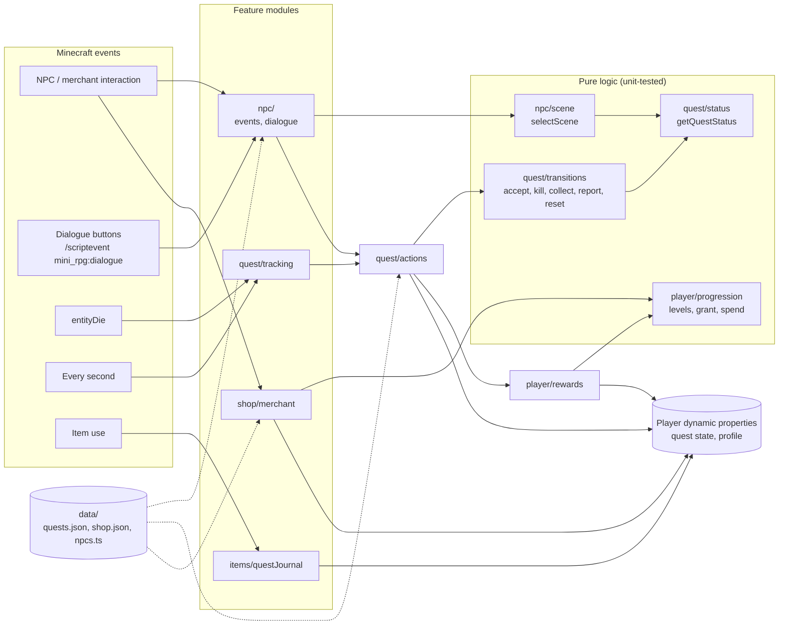
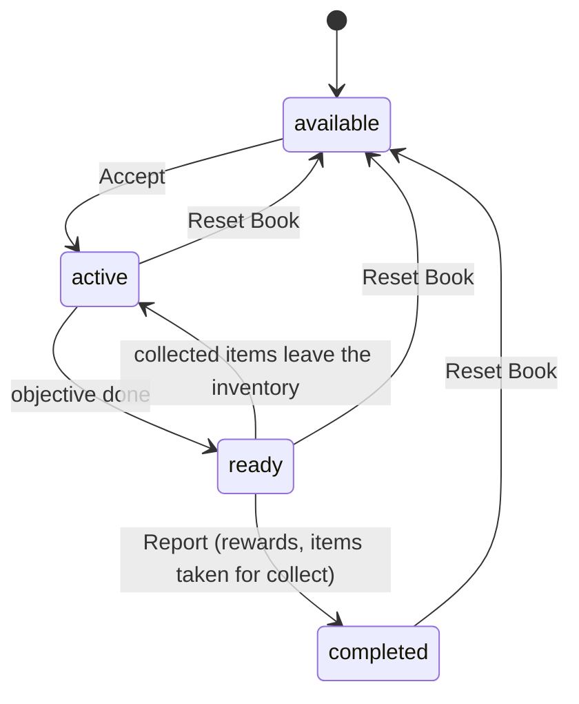

# Mini RPG — Minecraft Bedrock Add-On

A small RPG layer for Minecraft: Bedrock Edition, built with the Script API (TypeScript) and native NPC dialogue: quest NPCs, kill and collect quests, XP and levels, coins, a shop and a quest journal. All of it is saved per player and works in multiplayer.

| NPC | Quest | Objective | Rewards |
|---|---|---|---|
| **Ardan the Guard** (`mini_rpg:npc1`) | Zombie Hunter | Kill 5 zombies | 60 XP, 25 coins, 5 emeralds |
| **Mira the Hunter** (`mini_rpg:npc2`) | Skeleton Patrol | Kill 3 skeletons | 50 XP, 20 coins, 3 emeralds |
| | Bone Collector (offered after Skeleton Patrol) | Collect 6 bones | 80 XP, 40 coins |
| **Bram the Merchant** (`mini_rpg:merchant`, wandering trader look) | Shop | Buy items with coins | |

## Features

- **Quests from JSON** (`scripts/data/quests.json`) with two objective types:
  - **kill**: counts kills of an entity type;
  - **collect**: progress follows the player's inventory, and the items are taken when reporting.
- **Quest NPCs** with native dialogue. An NPC can hold several quests and offers them in order. The player accepts, completes the objective, then **reports back**: the Report button only appears once the objective is done.
- **XP and levels:** level *n* → *n+1* needs 100 × *n* XP. Leveling up shows a "Level Up!" title.
- **Coins:** earned from quests and spent at **Bram's shop**. The shop's items and prices come from JSON (`scripts/data/shop.json`).
- **Quest UI:**
  - "Quest Accepted!" and "Quest Complete!" titles with the rewards;
  - a progress line above the hotbar;
  - chat messages;
  - the **Quest Journal** item, which shows level, XP, coins, the active quest and completed quests.
- **Persistent per-player data:** quest state and profile (XP, coins) are saved as player dynamic properties.
- **Multiplayer:** every player has their own quests, progress display, coins and level. Dialogue buttons act on the player who pressed them.
- **Two languages:** English (`en_US`) and Indonesian (`id_ID`). The game picks one from the player's language setting.

## Screenshots

Shown with the game set to Indonesian (`id_ID`).

| Quest offer (Accept / Leave) | Quest accepted |
|---|---|
|  |  |
| **Progress above the hotbar** | **Quest complete: XP, coins and items** |
|  |  |
| **Bram's shop** | **Busy: another NPC's quest is active** |
|  |  |

## Quick start

```powershell
npm i
npm run local-deploy -- --watch   # build + deploy to com.mojang, rebuild on change
npm run mcaddon                   # dist/packages/mini_rpg.mcaddon
```

Requires Minecraft 1.26.50+ and Node.js LTS. The deploy location is set in `.env`.

In game (cheats on):
- `/summon mini_rpg:npc1`, `/summon mini_rpg:npc2` and `/summon mini_rpg:merchant` place the NPCs.
- `/give @s mini_rpg:quest_journal` gives the journal.

## Checks

```powershell
npm test            # Vitest: game logic + pack content consistency
npm run typecheck   # tsc for scripts and tests
npm run lint        # ESLint + Prettier
```

GitHub Actions runs all three plus `npm run build` on every push and pull request (`.github/workflows/ci.yml`).

**Releases:** the version lives in `package.json`, and both pack manifests carry the same version (checked by the tests). To release:
1. Bump all three together.
2. Push the tag `v<version>`, e.g. `v1.0.0`.
3. `.github/workflows/release.yml` refuses a tag that doesn't match `package.json`, then builds `mini_rpg.mcaddon` and attaches it to a GitHub Release.

| Test file | Covers |
|---|---|
| `tests/quest.test.ts` | Quest lifecycle and guards: one active quest per player, wrong kill types, kills after the objective is done, collect progress following the inventory (and dropping back when items leave it), reporting early or twice, resets, corrupted save data |
| `tests/scene.test.ts` | Which dialogue scene an NPC shows: quests offered in order, progress/ready, busy, thanks |
| `tests/progression.test.ts` | Level thresholds, granting XP and coins, buying with exact and insufficient coins, corrupted profile data |
| `tests/content.test.ts` | Cross-checks the JSON/TS data, dialogue files, entity and item files, manifests and lang files, since they refer to each other by plain strings. Covers valid objectives and rewards, each quest given by exactly one NPC, scenes with the right `npc_name`, `/scriptevent` commands and buttons, shop offers, item icons, pack versions matching `package.json` (and each other), Script API versions matching `package.json`, well-formed lang lines, and every lang key existing in every locale with the same `%s` placeholders |

## Architecture

```
scripts/
  main.ts          registers each feature
  data/            quests.json, shop.json, NPC definitions
  quest/           state, status, transitions (pure), actions, tracking (kills, collect, HUD)
  player/          profile (XP, coins), progression (pure), rewards, inventory
  npc/             interaction, dialogue, scene selection (pure)
  shop/            merchant and shop menu
  items/           Quest Journal, Quest Reset Book (dev tool)
behavior_packs/mini_rpg/   entities, dialogue scenes, items
resource_packs/mini_rpg/   models, textures, lang
tests/                     Vitest tests (no Minecraft runtime needed)
```



**Quest lifecycle.** A quest's status is worked out in one place, `getQuestStatus()`. The transitions in `quest/transitions.ts` are pure functions (`state → next state`, or `undefined` when not allowed). `quest/actions.ts` applies them to the player's saved state and handles chat, titles, sound, the actionbar, the inventory and rewards:



**NPC flow.**
1. The player interacts with an NPC, and the script cancels the built-in interaction.
2. `selectScene()` picks the scene for the player's state:
   - progress or ready for their quest with this NPC;
   - otherwise the intro of the next available quest;
   - otherwise busy or thanks.
3. The script opens that scene with `/dialogue open`.
4. Every button, and opening or closing the dialogue, runs `/scriptevent mini_rpg:dialogue <npcTypeId> <action> [questId]`.
5. The script handles `accept` and `report` in `quest/actions.ts`, and re-applies the NPC's name tag.

## Key decisions

- **Official build setup:** Microsoft's [`ts-starter`](https://github.com/microsoft/minecraft-scripting-samples/tree/main/ts-starter) (`just-scripts`).
- **Pure core, thin game layer:** quest transitions, scene selection and progression rules don't touch Minecraft APIs, so they're unit-tested in Node. The game modules only load and save state and show the results.
- **JSON-driven content:** quests and the shop are JSON, bundled into the script at build time. `tests/content.test.ts` validates them, along with the dialogue, entity and lang files they point to.
- **Native NPC dialogue:** scenes are defined in data files, and buttons reach the script through `/scriptevent`.
- **Report required:** finishing the objective sets the quest to `ready`; only the NPC's Report button completes it.
- **Collect follows the inventory:** progress is what the player is carrying. It is rechecked every second and before reporting, so dropping items can't be used to cheat a report.
- **Coins as data, not items:** coins are saved in the player profile. They can't be dropped, lost or duplicated with item glitches.
- **Per-player HUD:** progress is shown on each player's actionbar, not the scoreboard sidebar, which is shared by everyone.
- **Localized text:** all player-facing text lives in `resource_packs/mini_rpg/texts/*.lang`. Scripts and dialogue files only reference lang keys (`translate`/rawtext). The exception is NPC names, which stay plain text on purpose (`name` in `data/npcs.ts` and `npc_name` in the dialogue file, same text in both).

## Known limitations

- **NPC name tag and `minecraft:npc`.** The component keeps its own name (default `§eNPC`). When a dialogue opens or closes, players' screens show "NPC" again while the server still has the right name, and writing the same name again isn't sent to players.
  - So the script re-applies the name on spawn, on load, on world load (including `/reload`), when a player joins, and on every `mini_rpg:dialogue` event.
  - Each write toggles between `§e<name>` and `§e<name>§r`, which look the same, so the value always changes and is sent.
  - The name may briefly show "NPC". Changing the component's own name needs `EntityNpcComponent.name`, which is only in the beta Script API.
- **Only direct kills count.** A kill counts when the player is the damaging entity (melee or their own arrow). Kills by pets, TNT, lava or fall damage don't.
- **One active quest at a time** per player, by design.

## Adding content

**A quest:** add an entry to `scripts/data/quests.json`:
- objective: `kill` with `target`, or `collect` with `item`, plus `count`;
- rewards;
- title and description keys.

**An NPC:**
1. Add an entry to `NPCS` in `scripts/data/npcs.ts`: type id, name, its quests with three scene tags each, and the busy and thanks scenes.
2. Copy `behavior_packs/mini_rpg/entities/npc1.json` and `resource_packs/mini_rpg/entity/npc1.entity.json` with the new type id.
3. Copy `behavior_packs/mini_rpg/dialogue/npc1.json`, then change the scene tags, `npc_name`, and the type id and quest ids in every `/scriptevent` command.

**Shop items:** edit `scripts/data/shop.json` (`itemType`, `amount`, `price`).

**Text:** add the new keys to every `.lang` file.

No logic changes are needed. Run `npm test`, and `tests/content.test.ts` reports anything missed or mistyped.

## Adding a language

1. Copy `resource_packs/mini_rpg/texts/en_US.lang` to `<locale>.lang` (e.g. `ja_JP.lang`) and translate the values. Keep the keys and the `%s` placeholders.
2. Add the locale to `resource_packs/mini_rpg/texts/languages.json`.
3. Do the same for the pack name in `behavior_packs/mini_rpg/texts/`.

The tests check that every locale has the same keys as `en_US.lang`.

## Dev tool: Quest Reset Book

`mini_rpg:quest_reset` is a debugging and testing aid, not a gameplay item. Use it to replay a quest without making a new world or player.

- Get it with `/give @s mini_rpg:quest_reset`, or from the Creative inventory.
- Using it opens a menu with:
  - your taken quests (Active, Ready to report, or Completed); picking one sets it back to `available`;
  - **Reset XP & Coins**, showing the current level, XP and coins; it sets XP and coins back to 0.
- Resetting a quest doesn't take back XP, coins or items already given.
- Any player holding the item can reset their own quests; there is no permission check.
- To ship without it, remove `scripts/items/questReset.ts`, `behavior_packs/mini_rpg/items/quest_reset.json` and `registerQuestResetItem()` in `main.ts`.
